# Go ECS Benchmarks

Comparative benchmarks for Go Entity Component System (ECS) implementations.

> Disclaimer: This repository is maintained by the author of [Ark](https://github.com/mlange-42/ark).

## Benchmark candidates

| ECS | Tested | Latest | Activity |
|-----|--------|--------|----------|
| [Ark](https://github.com/mlange-42/ark) | v0.8.3 |   |  |
| [Donburi](https://github.com/yohamta0/donburi-ecs) | v1.15.7 |   |  |
| [go‑gameengine‑ecs](https://github.com/marioolofo/go-gameengine-ecs) | v0.9.0 |   |  |
| [GOKe](https://github.com/kjkrol/goke) | v3.1.0 |   |  |
| [unitoftime/ecs](https://github.com/unitoftime/ecs) | v0.0.3 |   |  |
| [Volt](https://github.com/akmonengine/volt) | v1.7.0 |   |  |

Candidates are always displayed in alphabetical order.

In case you develop or use a Go ECS that is not in the list and that want to see here,
please open an issue or make a pull request.
See the section on [Contributing](#contributing) for details.

In case you are a developer or user of an implementation included here,
feel free to check the benchmarked code for any possible improvements.
Open an issue if you want a version update.

## Features

| ECS | Type-safe API | ID-based API | Relations | Events<sup>[1]</sup> | Batches<sup>[2]</sup> | Command buffer |
|-----|:-------------:|:------------:|:---------:|:-------:|:-------:|:--------------:|
| [Ark](https://github.com/mlange-42/ark) | ✅ | ✅ | ✅ | ✅ | ✅ | ❌ |
| [Donburi](https://github.com/yohamta0/donburi-ecs) | ✅ | ❌ | ❌ | ❌ | ❌ | ❌ |
| [go‑gameengine‑ecs](https://github.com/marioolofo/go-gameengine-ecs) | ❌ | ✅ | ❌ | ❌ | ❌ | ❌ |
| [GOKe](https://github.com/kjkrol/goke) | ✅ |  ✅ | ❌ | ❌ |  ✅ | ✅ |
| [unitoftime/ecs](https://github.com/unitoftime/ecs) | ✅ | ❌ | ❌ | ❌ | ❌ | ✅ |
| [Volt](https://github.com/akmonengine/volt) | ✅ | ❌ | ❌ | ✅ | ❌ | ❌ |

[1] ECS lifecycle events, allowing to react to entity creation, component addition, ...  
[2] Faster batch operations for entity creation etc.

## Benchmarks

Last run: Fri, 21 Aug 2026 21:48:28 UTC  
CPU: INTEL(R) XEON(R) PLATINUM 8573C


For each benchmark, the left plot panel and the table show the time spent per entity,
while the right panel shows the total time.

Note that the Y axis has logarithmic scale in all plots.
So doubled bar or line height is not doubled time!

All components used in the benchmarks have two `float64` fields.
The initial capacity of the world is set to 1024 where this is supported.

### Query

`N` entities with components `Position` and `Velocity`.
10x `N` entities with components `Position`.

- Query all `[Position, Velocity]` entities, and add the velocity vector to the position vector.

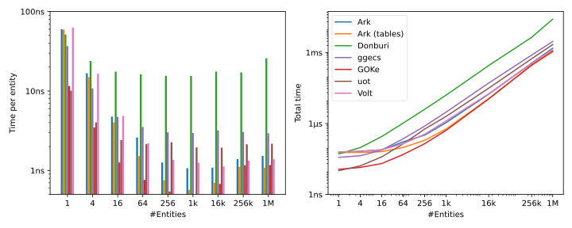

| N | Ark | Ark (tables) | Donburi | ggecs | GOKe | uot | Volt |
| --- | --- | --- | --- | --- | --- | --- | --- |
| 1 | 59.79ns | 59.16ns | 51.44ns | 36.76ns | 11.56ns | 10.08ns | 62.92ns |
| 4 | 16.72ns | 14.97ns | 23.86ns | 10.80ns | 3.46ns | 4.03ns | 16.46ns |
| 16 | 4.76ns | 4.02ns | 17.53ns | 4.72ns | 1.26ns | 2.42ns | 4.86ns |
| 64 | 2.60ns | 1.52ns | 16.23ns | 3.53ns | 0.76ns | 2.15ns | 2.19ns |
| 256 | 1.26ns | 0.75ns | 15.56ns | 3.02ns | 0.54ns | 2.27ns | 1.36ns |
| 1k | 1.07ns | 0.57ns | 15.45ns | 2.97ns | 0.50ns | 1.95ns | 1.25ns |
| 16k | 1.09ns | 0.70ns | 17.60ns | 3.20ns | 0.68ns | 1.93ns | 1.13ns |
| 256k | 1.39ns | 1.12ns | 17.18ns | 3.05ns | 1.16ns | 2.14ns | 1.33ns |
| 1M | 1.52ns | 1.08ns | 25.83ns | 2.94ns | 1.17ns | 2.17ns | 1.38ns |


> **Note:** Donburi, unitoftime/ecs, and Volt use a callback-based approach for their query loops.
As a result, iteration speed may degrade if the callback contains complex logic
and the Go compiler is unable to inline it.

### Query fragmented, inner

Query where the matching entities are fragmented over 32 archetypes.

`N` entities with components `Position` and `Velocity`.
Each of these `N` entities has some combination of components
`C1`, `C2`, ..., `C5`, so entities are fragmented over up to 32 archetypes.

- Query all `[Position, Velocity]` entities, and add the velocity vector to the position vector.

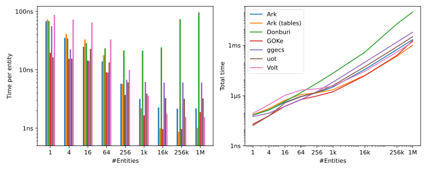

| N | Ark | Ark (tables) | Donburi | GOKe | ggecs | uot | Volt |
| --- | --- | --- | --- | --- | --- | --- | --- |
| 1 | 57.15ns | 59.05ns | 49.64ns | 12.08ns | 40.94ns | 9.96ns | 66.58ns |
| 4 | 20.79ns | 24.97ns | 31.45ns | 10.50ns | 13.01ns | 8.77ns | 58.19ns |
| 16 | 13.29ns | 18.61ns | 27.30ns | 9.33ns | 7.57ns | 12.98ns | 50.92ns |
| 64 | 7.32ns | 9.66ns | 20.77ns | 5.01ns | 5.11ns | 7.87ns | 26.47ns |
| 256 | 3.56ns | 3.35ns | 18.78ns | 2.46ns | 3.83ns | 3.74ns | 7.67ns |
| 1k | 1.90ns | 1.33ns | 15.97ns | 1.03ns | 3.28ns | 2.37ns | 3.32ns |
| 16k | 1.12ns | 0.74ns | 23.30ns | 0.72ns | 3.12ns | 1.98ns | 1.25ns |
| 256k | 1.44ns | 1.12ns | 26.54ns | 1.21ns | 2.89ns | 2.17ns | 1.41ns |
| 1M | 1.41ns | 1.08ns | 64.88ns | 1.23ns | 2.86ns | 2.18ns | 1.40ns |


> **Note:** Donburi, unitoftime/ecs, and Volt use a callback-based approach for their query loops.
As a result, iteration speed may degrade if the callback contains complex logic
and the Go compiler is unable to inline it.

### Query fragmented, outer

Query where there are 256 non-matching archetypes.

`N` entities with components `Position` and `Velocity`.
Another `4 * N` entities with `Position` and some combination of 8 components
`C1`, ..., `C8`, so these entities are fragmented over up to 256 archetypes.

- Query all `[Position, Velocity]` entities, and add the velocity vector to the position vector.

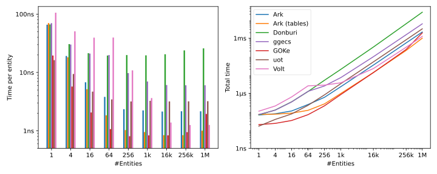

| N | Ark | Ark (tables) | Donburi | ggecs | GOKe | uot | Volt |
| --- | --- | --- | --- | --- | --- | --- | --- |
| 1 | 57.05ns | 65.85ns | 52.01ns | 46.78ns | 11.52ns | 10.16ns | 81.13ns |
| 4 | 16.66ns | 14.68ns | 23.90ns | 20.41ns | 3.67ns | 5.59ns | 45.22ns |
| 16 | 4.76ns | 4.12ns | 17.90ns | 12.36ns | 1.31ns | 2.79ns | 33.22ns |
| 64 | 2.31ns | 1.46ns | 16.22ns | 11.34ns | 0.79ns | 2.47ns | 30.97ns |
| 256 | 1.41ns | 0.77ns | 15.64ns | 5.04ns | 0.56ns | 2.16ns | 8.73ns |
| 1k | 1.06ns | 0.58ns | 17.50ns | 3.47ns | 0.50ns | 1.95ns | 2.97ns |
| 16k | 1.07ns | 0.71ns | 16.70ns | 2.87ns | 0.69ns | 1.93ns | 1.20ns |
| 256k | 1.49ns | 1.09ns | 17.53ns | 2.88ns | 1.17ns | 2.28ns | 1.33ns |
| 1M | 1.45ns | 1.08ns | 19.10ns | 2.93ns | 1.15ns | 2.22ns | 1.35ns |


> **Note:** Donburi, unitoftime/ecs, and Volt use a callback-based approach for their query loops.
As a result, iteration speed may degrade if the callback contains complex logic
and the Go compiler is unable to inline it.

### Component random access

`N` entities with component `Position`.
All entities are collected into a slice, and the slice is shuffled.

* Iterate the shuffled entities.
* For each entity, get its `Position` and sum up their `X` fields.

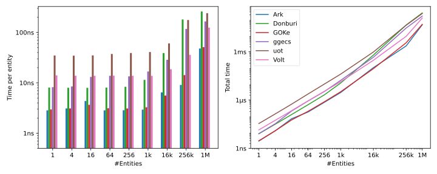

| N | Ark | Donburi | GOKe | ggecs | uot | Volt |
| --- | --- | --- | --- | --- | --- | --- |
| 1 | 2.84ns | 8.05ns | 2.96ns | 8.20ns | 34.91ns | 14.06ns |
| 4 | 3.10ns | 7.96ns | 3.10ns | 8.46ns | 34.58ns | 13.84ns |
| 16 | 4.35ns | 7.93ns | 3.66ns | 13.12ns | 35.08ns | 13.77ns |
| 64 | 2.84ns | 8.03ns | 3.13ns | 13.78ns | 37.39ns | 13.88ns |
| 256 | 2.85ns | 8.36ns | 3.09ns | 13.46ns | 39.04ns | 13.77ns |
| 1k | 2.93ns | 11.45ns | 3.27ns | 16.78ns | 40.81ns | 13.76ns |
| 16k | 6.46ns | 38.97ns | 5.58ns | 28.62ns | 60.72ns | 18.62ns |
| 256k | 9.08ns | 180.70ns | 14.22ns | 117.61ns | 176.19ns | 35.91ns |
| 1M | 47.92ns | 260.90ns | 51.08ns | 165.57ns | 241.18ns | 124.68ns |


### Create entities

- Create `N` entities with components `Position` and `Velocity`.

The operation is performed once before benchmarking,
to exclude memory allocation, archetype creation etc.
See the benchmark below for entity creation with allocation.

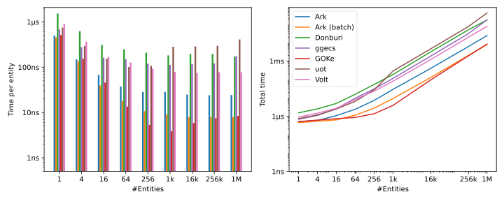

| N | Ark | Ark (batch) | Donburi | ggecs | GOKe | uot | Volt |
| --- | --- | --- | --- | --- | --- | --- | --- |
| 1 | 179.94ns | 175.45ns | 991.84ns | 257.70ns | 175.20ns | 334.01ns | 469.15ns |
| 4 | 71.06ns | 51.08ns | 509.31ns | 143.51ns | 47.52ns | 194.85ns | 244.46ns |
| 16 | 45.76ns | 19.90ns | 337.48ns | 160.20ns | 16.07ns | 161.63ns | 162.27ns |
| 64 | 40.92ns | 14.16ns | 229.91ns | 131.52ns | 6.80ns | 139.47ns | 115.30ns |
| 256 | 30.44ns | 13.27ns | 196.29ns | 93.92ns | 5.45ns | 107.22ns | 73.12ns |
| 1k | 29.76ns | 12.15ns | 182.12ns | 90.58ns | 4.63ns | 273.57ns | 76.12ns |
| 16k | 23.60ns | 8.80ns | 193.90ns | 94.80ns | 8.68ns | 276.95ns | 73.82ns |
| 256k | 25.19ns | 8.72ns | 194.94ns | 196.40ns | 10.81ns | 463.05ns | 72.84ns |
| 1M | 25.36ns | 9.23ns | 168.86ns | 211.85ns | 13.56ns | 480.03ns | 71.94ns |


### Create entities, allocating

- Create `N` entities with components `Position` and `Velocity`.

Each round is performed on a fresh world.
This reflects the creation of the first entities with a certain components set in your game or application.
As soon as things stabilize, the benchmarks for entity creation without allocation (above) apply.

Low `N` values might be biased by things like archetype creation and memory allocation,
which is handled differently by different implementations.

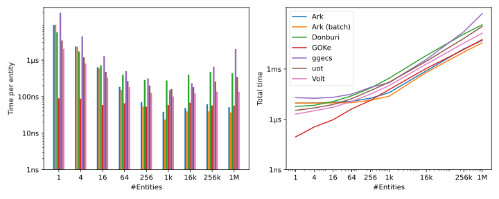

| N | Ark | Ark (batch) | Donburi | GOKe | ggecs | uot | Volt |
| --- | --- | --- | --- | --- | --- | --- | --- |
| 1 | 9.18us | 9.33us | 5.84us | 90.03ns | 19.71us | 3.44us | 2.04us |
| 4 | 2.36us | 2.33us | 1.72us | 88.16ns | 4.50us | 1.19us | 810.46ns |
| 16 | 636.81ns | 596.54ns | 721.39ns | 58.71ns | 1.28us | 475.51ns | 329.60ns |
| 64 | 186.66ns | 153.98ns | 395.64ns | 65.85ns | 498.43ns | 267.52ns | 182.96ns |
| 256 | 70.56ns | 53.45ns | 285.43ns | 52.63ns | 315.50ns | 200.83ns | 125.45ns |
| 1k | 38.32ns | 23.51ns | 277.38ns | 58.49ns | 149.86ns | 160.65ns | 101.08ns |
| 16k | 48.66ns | 39.29ns | 401.29ns | 68.05ns | 233.62ns | 182.10ns | 123.20ns |
| 256k | 61.76ns | 39.38ns | 474.32ns | 56.99ns | 652.15ns | 259.82ns | 136.58ns |
| 1M | 51.18ns | 36.64ns | 433.97ns | 56.68ns | 2.00us | 344.44ns | 136.67ns |


### Create large entities

- Create `N` entities with 10 components `C1`, ..., `C10`.

The operation is performed once before benchmarking,
to exclude things like archetype creation and memory allocation.

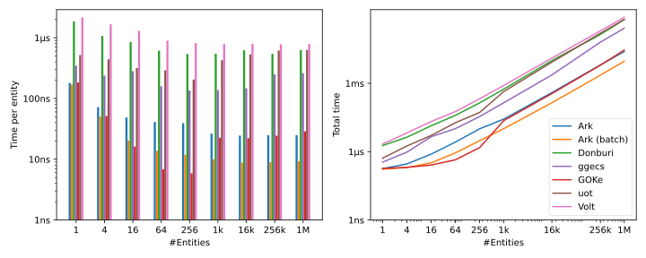

| N | Ark | Ark (batch) | Donburi | ggecs | GOKe | uot | Volt |
| --- | --- | --- | --- | --- | --- | --- | --- |
| 1 | 179.69ns | 169.51ns | 1.85us | 346.60ns | 182.97ns | 518.08ns | 2.16us |
| 4 | 72.04ns | 50.23ns | 1.07us | 237.84ns | 51.14ns | 442.95ns | 1.66us |
| 16 | 48.69ns | 20.25ns | 851.23ns | 281.21ns | 16.15ns | 318.45ns | 1.30us |
| 64 | 41.05ns | 13.76ns | 613.56ns | 159.59ns | 6.84ns | 291.21ns | 894.73ns |
| 256 | 39.23ns | 11.84ns | 539.85ns | 135.60ns | 5.87ns | 205.10ns | 817.21ns |
| 1k | 26.32ns | 10.02ns | 546.31ns | 137.61ns | 22.55ns | 427.09ns | 791.10ns |
| 16k | 24.49ns | 8.79ns | 621.91ns | 146.35ns | 22.14ns | 530.53ns | 796.29ns |
| 256k | 24.85ns | 8.90ns | 543.08ns | 249.92ns | 24.43ns | 616.20ns | 782.94ns |
| 1M | 24.93ns | 9.27ns | 623.29ns | 261.40ns | 28.69ns | 629.36ns | 791.34ns |


### Add/remove component

`N` entities with component `Position`.

- Add `Velocity` to all entities.
- Remove `Velocity` from all entities.

One iteration is performed before the benchmarking starts, to exclude memory allocation.

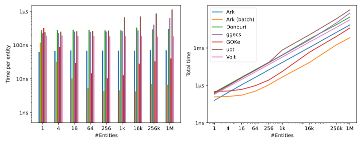

| N | Ark | Ark (batch) | Donburi | ggecs | GOKe | uot | Volt |
| --- | --- | --- | --- | --- | --- | --- | --- |
| 1 | 97.57ns | 167.68ns | 399.10ns | 416.70ns | 472.89ns | 342.68ns | 259.53ns |
| 4 | 107.20ns | 45.52ns | 405.35ns | 419.92ns | 130.79ns | 338.46ns | 266.61ns |
| 16 | 107.08ns | 17.76ns | 402.16ns | 451.89ns | 44.01ns | 348.94ns | 265.20ns |
| 64 | 106.93ns | 10.75ns | 403.83ns | 452.29ns | 22.76ns | 350.81ns | 265.18ns |
| 256 | 105.62ns | 8.70ns | 396.26ns | 452.83ns | 16.87ns | 360.57ns | 262.34ns |
| 1k | 104.14ns | 8.70ns | 400.32ns | 467.81ns | 17.14ns | 733.56ns | 261.68ns |
| 16k | 103.57ns | 9.49ns | 432.37ns | 506.61ns | 35.74ns | 793.13ns | 263.08ns |
| 256k | 104.54ns | 10.61ns | 405.65ns | 820.63ns | 44.41ns | 1.24us | 253.50ns |
| 1M | 103.61ns | 11.74ns | 407.66ns | 939.90ns | 46.10ns | 1.41us | 254.93ns |


### Add/remove component, large entity

`N` entities with component `Position` and 10 further components `C1`, ..., `C10`.

- Add `Velocity` to all entities.
- Remove `Velocity` from all entities.

One iteration is performed before the benchmarking starts, to exclude memory allocation.

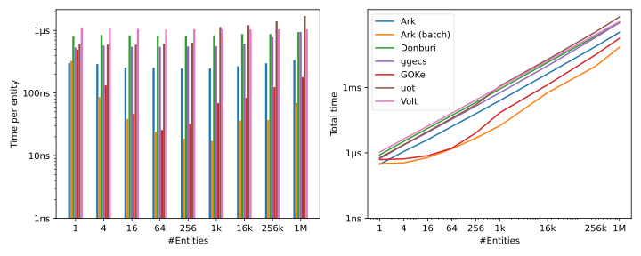

| N | Ark | Ark (batch) | Donburi | ggecs | GOKe | uot | Volt |
| --- | --- | --- | --- | --- | --- | --- | --- |
| 1 | 337.06ns | 440.33ns | 1.11us | 843.89ns | 651.69ns | 834.47ns | 1.39us |
| 4 | 385.52ns | 122.62ns | 1.14us | 870.82ns | 179.78ns | 853.43ns | 1.36us |
| 16 | 389.82ns | 47.93ns | 1.12us | 890.39ns | 65.20ns | 827.53ns | 1.34us |
| 64 | 392.16ns | 25.45ns | 1.11us | 868.04ns | 37.36ns | 873.81ns | 1.34us |
| 256 | 381.17ns | 22.10ns | 1.10us | 880.77ns | 38.00ns | 910.07ns | 1.33us |
| 1k | 414.88ns | 20.55ns | 1.17us | 898.10ns | 89.89ns | 1.47us | 1.38us |
| 16k | 434.18ns | 22.26ns | 1.26us | 1.09us | 117.90ns | 1.58us | 1.54us |
| 256k | 538.60ns | 45.43ns | 1.33us | 1.55us | 138.98ns | 2.03us | 1.58us |
| 1M | 478.06ns | 41.55ns | 1.31us | 1.63us | 177.46ns | 2.08us | 1.59us |


### Delete entities

`N` entities with components `Position` and `Velocity`.

* Delete all entities

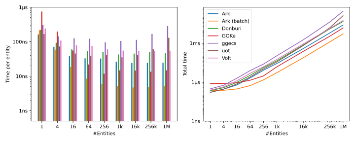

| N | Ark | Ark (batch) | Donburi | GOKe | ggecs | uot | Volt |
| --- | --- | --- | --- | --- | --- | --- | --- |
| 1 | 94.23ns | 143.17ns | 227.67ns | 1.08us | 411.38ns | 109.61ns | 254.69ns |
| 4 | 47.85ns | 39.70ns | 93.18ns | 259.69ns | 194.07ns | 56.98ns | 142.49ns |
| 16 | 47.68ns | 14.29ns | 67.87ns | 78.04ns | 147.26ns | 47.63ns | 96.05ns |
| 64 | 33.66ns | 6.55ns | 45.00ns | 25.42ns | 100.31ns | 38.18ns | 62.08ns |
| 256 | 25.31ns | 4.82ns | 36.54ns | 13.78ns | 77.28ns | 32.80ns | 44.18ns |
| 1k | 22.21ns | 3.61ns | 28.39ns | 11.11ns | 72.89ns | 27.76ns | 43.58ns |
| 16k | 15.67ns | 3.19ns | 27.98ns | 11.98ns | 72.83ns | 28.95ns | 33.78ns |
| 256k | 16.34ns | 3.36ns | 27.29ns | 12.72ns | 147.86ns | 52.64ns | 34.30ns |
| 1M | 16.73ns | 3.50ns | 28.10ns | 13.60ns | 275.72ns | 74.35ns | 35.64ns |


### Delete large entities

`N` entities with 10 components `C1`, ..., `C10`.

* Delete all entities

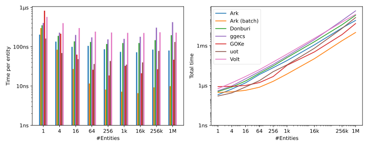

| N | Ark | Ark (batch) | Donburi | ggecs | GOKe | uot | Volt |
| --- | --- | --- | --- | --- | --- | --- | --- |
| 1 | 159.79ns | 216.83ns | 397.73ns | 502.88ns | 1.04us | 107.37ns | 669.10ns |
| 4 | 125.20ns | 62.50ns | 215.90ns | 307.89ns | 268.46ns | 52.73ns | 480.52ns |
| 16 | 114.93ns | 23.00ns | 132.91ns | 231.65ns | 90.06ns | 49.28ns | 287.82ns |
| 64 | 77.14ns | 10.79ns | 98.10ns | 146.53ns | 33.43ns | 35.30ns | 213.86ns |
| 256 | 77.26ns | 8.11ns | 84.74ns | 127.62ns | 18.50ns | 31.10ns | 189.54ns |
| 1k | 52.30ns | 6.64ns | 83.14ns | 105.62ns | 27.63ns | 28.63ns | 181.23ns |
| 16k | 49.20ns | 7.62ns | 83.70ns | 117.51ns | 21.30ns | 26.48ns | 180.49ns |
| 256k | 72.84ns | 7.71ns | 77.61ns | 254.58ns | 31.88ns | 52.12ns | 180.53ns |
| 1M | 79.52ns | 15.11ns | 148.99ns | 446.70ns | 56.77ns | 68.81ns | 182.33ns |


### Create world

- Create a new world

| N | Ark | Donburi | GOKe | ggecs | uot | Volt |
| --- | --- | --- | --- | --- | --- | --- |
| 1 | 34.07us | 3.51us | 925.95us | 276.03us | 3.43us | 23.36us |


### Popularity

Given that all tested projects are on Github, we can use the star history as a proxy here.

<p align="center">
<a title="Star History Chart" href="https://star-history.com/#mlange-42/ark&yohamta0/donburi-ecs&marioolofo/go-gameengine-ecs&kjkrol/goke&unitoftime/ecs&akmonengine/volt&Date">

</a>
</p>

## Running the benchmarks

Run the benchmarks using the following command:

```shell
go run . -test.benchtime=10x
```

> On PowerShell use this instead:  
> `go run . --% -test.benchtime=10x`

The `benchtime` limit is required for some of the benchmarks that have a high
setup cost which is not timed. They would take forever otherwise.
The benchmarks can take up to one hour to complete.

To run a selection of benchmarks, add their names as arguments:

```shell
go run . query2comp query32arch
```

To create the plots, run `plot/plot.py`. The following packages are required:
- numpy
- pandas
- matplotlib

```
pip install -r ./plot/requirements.txt
python plot/plot.py
```

## Contributing

Developers of ECS frameworks are welcome to add their implementation to the benchmarks.
However, there are a few (quality) criteria that need to be fulfilled for inclusion:

- All benchmarks must be implemented, which means that the ECS must have the required features
- The ECS must be working properly and not exhibit serious flaws; it will undergo a basic review by maintainers
- The ECS must be sufficiently documented so that it can be used without reading the code
- There must be at least basic unit tests
- Unit tests must be run in the CI of the repository
- The ECS *must not* be tightly coupled to a particular game engine, particularly graphics stuff
- There must be tagged release versions; only tagged versions will be included here

Developers of included frameworks are encouraged to review the benchmarks,
and to fix (or point to) misuse or potential optimizations.

## Automated results PRs

Pull requests from the `bench-results-update` branch are opened automatically by the `publish` job
in `.github/workflows/benchmarks.yml`, after a benchmark run on `main` — they only refresh
`README.md` and `docs/results/**` (the plotted numbers/images), never benchmark code, and don't need
the code-review criteria above. That branch is force-pushed on every run, so there's at most one such
PR open at a time, reused rather than duplicated. Everything else (`bench/**`, `go.mod`, workflow,
docs) is normal work, reviewed as usual.
